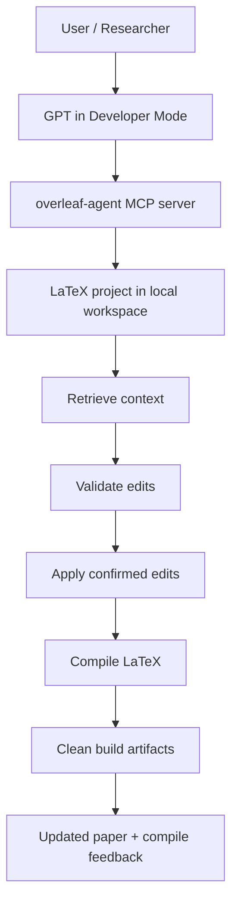
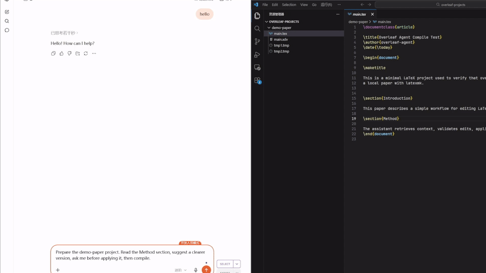

# overleaf-agent

A local MCP writing assistant for LaTeX and Overleaf-style projects.

This server lets GPT Developer Mode work with LaTeX projects on your local machine. It can inspect projects, retrieve section context, validate edits, apply confirmed edits, compile with `latexmk`, clean build artifacts, and initialize a project from a confirmed template URL.

## Workflow


## Demo




## Quick Start

Install these first:

- Python 3.11 or newer
- MiKTeX
- Strawberry Perl
- ngrok, if you want GPT Developer Mode to reach your local MCP server

Then install and start the server:

```powershell
git clone https://github.com/YOUR_NAME/overleaf-agent.git
cd overleaf-agent

conda create -n overleaf-agent python=3.11 -y
conda activate overleaf-agent
pip install -e .

powershell -ExecutionPolicy Bypass -File .\scripts\start_http_server.ps1 `
  -WorkspaceDir "PATH\TO\YOUR\WORKSPACE" `
  -Port 8000 `
  -PythonExe "PATH\TO\YOUR\CONDA\ENV\python.exe"
```

Examples:

```powershell
-WorkspaceDir "D:\latex-projects"
-PythonExe "D:\Anaconda\envs\overleaf-agent\python.exe"
```

Expose the local server with ngrok:

```powershell
ngrok http 8000
```

Use the generated endpoint in GPT Developer Mode:

```text
https://xxxx.ngrok-free.app/mcp
```


## Motivation

Researchers often use LLMs to polish academic papers, but the workflow is still awkward: copy text from Overleaf, paste it into GPT, copy the revision back, then manually find the right section again and hope the LaTeX still compiles.

This project was built to make that loop smoother. It connects GPT to a local Overleaf-style LaTeX project through MCP tools, so GPT can inspect the project structure, retrieve the relevant section with surrounding context, propose or apply confirmed edits, compile the paper locally, and clean build artifacts.

The goal is not to let an AI rewrite a paper silently. The goal is to keep the author in control while giving GPT access to the real project context, including section structure, LaTeX commands, references, templates, and compilation feedback.

## What It Can Do

- List local LaTeX projects in a workspace.
- Prepare a project and detect its main `.tex` file.
- Retrieve paper sections and line ranges.
- Validate and apply safe text edits after user confirmation.
- Insert text at a validated line position.
- Compile LaTeX and parse errors when compilation fails.
- Clean intermediate LaTeX files while keeping the generated PDF.
- Install missing MiKTeX packages only after explicit user confirmation.
- Download a confirmed `.zip`, `.tar.gz`, `.tgz`, or `.tex` template URL into the workspace.

## Requirements

Windows is the primary tested environment.

Install these first:

- Python 3.11 or newer
- MiKTeX
- Strawberry Perl
- ngrok, if you want to expose the local HTTP MCP server to GPT Developer Mode

Check that these commands work in PowerShell:

```powershell
perl -v
miktex --version
latexmk -v
pdflatex --version
xelatex --version
biber --version
```

## Install

From the project root:

```powershell
conda create -n overleaf-agent python=3.11 -y
conda activate overleaf-agent
pip install -e .
```

`pip install -e .` is recommended because it installs dependencies and registers the `overleaf-agent-mcp` command.

If you only want to install Python dependencies:

```powershell
pip install -r requirements.txt
```

Then check the local LaTeX environment:

```powershell
python -m scripts.check_env
```

## Workspace

By default, projects live in:

```text
workspace
```

You can choose a different workspace with `WORKSPACE_DIR`.

Example:

```powershell
$env:WORKSPACE_DIR="E:\papers"
```

Relative paths are resolved from the repository root:

```powershell
$env:WORKSPACE_DIR="workspace"
```

Absolute paths are used directly:

```powershell
$env:WORKSPACE_DIR="D:\latex-projects"
```

You can also create a `.env` file in the repository root:

```text
WORKSPACE_DIR=D:\latex-projects
MCP_TRANSPORT=stdio
MCP_HOST=127.0.0.1
MCP_PORT=8000
MCP_PATH=/mcp
```

Values already set in the shell environment take priority over `.env`.

All MCP project operations are restricted to this workspace. This prevents GPT from accidentally using paths such as `/mnt/data`, `/mnt/user-data/uploads`, or `~/Draft`.

## Start The MCP Server For GPT

GPT Developer Mode needs to reach a local HTTP MCP server. Start it locally:

Recommended, robust Windows command:

```powershell
powershell -ExecutionPolicy Bypass -File .\scripts\start_http_server.ps1 `
  -WorkspaceDir "E:\overleaf-agent\workspace" `
  -Port 8000 `
  -PythonExe "D:\Anaconda\envs\overleaf-agent\python.exe"
```

Adjust `-PythonExe` to the Python executable inside your own conda environment.

If `overleaf-agent-mcp` is already available in your shell, this direct command also works:

```powershell
$env:WORKSPACE_DIR="E:\overleaf-agent\workspace"
overleaf-agent-mcp --http --host 127.0.0.1 --port 8000 --path /mcp
```

The helper script falls back to `python -m overleaf_agent.mcp_server` when `overleaf-agent-mcp` is not found. Passing `-PythonExe` avoids accidentally using the base Anaconda Python.

The local endpoint is:

```text
http://127.0.0.1:8000/mcp
```

## Expose It With ngrok

In another PowerShell window:

```powershell
ngrok http 8000
```

ngrok will print a public HTTPS URL, for example:

```text
https://example-name.ngrok-free.app
```

Use this MCP URL in GPT Developer Mode:

```text
https://example-name.ngrok-free.app/mcp
```

Keep both processes running:

- `overleaf-agent-mcp`
- `ngrok http 8000`

See [examples/gpt-ngrok.md](examples/gpt-ngrok.md) for a focused GPT + ngrok setup guide.

## Recommended GPT Workflow

Ask GPT to use the tools in this order:

```text
list_workspace_projects
prepare_project
retrieve_context
validate_insert_position / validate_text_edit / validate_text_range
ask user for confirmation
apply_insert_text / apply_text_edit / apply_text_range_edit
compile_project if needed
```

Important rules:

- GPT should call `list_workspace_projects` if the project name is unclear.
- GPT should call `prepare_project` before reading or editing a project.
- GPT should not invent `/mnt/data`, `/mnt/user-data/uploads`, or `~/...` paths.
- GPT should only pass project names returned by `list_workspace_projects`, or paths inside `WORKSPACE_DIR`.
- Edit tools require explicit user confirmation before modifying files.
- Successful compile/edit operations clean intermediate files and keep the PDF.
- Failed edits restore the original text when possible.

## Example User Requests

```text
List my available LaTeX projects.
```

```text
Prepare the Neurl2026 project.
```

```text
Read the Introduction section and suggest improvements.
```

```text
Insert this paragraph after the Introduction heading, then compile.
```

```text
Replace the official template instructions with a paper skeleton.
```

```text
Compile the project and explain any LaTeX errors.
```

## Template Initialization

If GPT finds an official LaTeX template URL, it should show the URL and target project name first. After you confirm, it can call:

```text
init_project_from_template_url
```

Supported URLs:

- `.zip`
- `.tar.gz`
- `.tgz`
- `.tex`

The downloaded project is created inside `WORKSPACE_DIR`.

## Missing LaTeX Packages

If compilation fails because a file such as `algorithm2e.sty` is missing, GPT should:

1. Explain the missing file.
2. Ask whether you want to install the package locally.
3. Call `install_latex_packages` only after confirmation.
4. Re-run compilation.

The install tool uses MiKTeX:

```text
miktex packages install <package_id>
```

## Troubleshooting

If GPT cannot find your project:

- Confirm `WORKSPACE_DIR` points to the folder containing your projects.
- Restart `overleaf-agent-mcp` after changing `WORKSPACE_DIR`.
- Ask GPT to call `list_workspace_projects`.

If GPT reports `/mnt/data/...`:

- That path is from a remote/cloud sandbox.
- Ask GPT to use `list_workspace_projects` and `prepare_project` through overleaf-agent instead.

If LaTeX commands work in PowerShell but fail in GPT:

- Restart the terminal running `overleaf-agent-mcp`.
- Confirm the same conda environment is active.
- Run `python -m scripts.check_env` in that terminal.

If the helper script reports `No module named overleaf_agent` or `The MCP SDK is not installed`:

- The script is probably using the wrong Python, often the base Anaconda Python.
- Run it with `-PythonExe`, pointing to the environment where you installed this project:

```powershell
powershell -ExecutionPolicy Bypass -File .\scripts\start_http_server.ps1 `
  -WorkspaceDir "E:\overleaf-agent\workspace" `
  -Port 8000 `
  -PythonExe "D:\Anaconda\envs\overleaf-agent\python.exe"
```

If `conda activate` does not work in PowerShell, either fix PowerShell execution policy or use the explicit `-PythonExe` approach above.

If ngrok changes URL:

- Update the MCP URL in GPT Developer Mode.
- The endpoint should end with `/mcp`.
